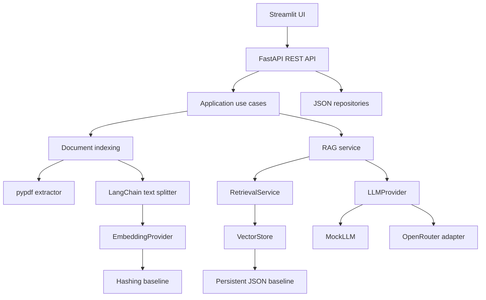

# AI Knowledge Assistant

[](https://github.com/RoccoDatena/AI-Knowledge-Assistant-LangChain-RAG-/actions/workflows/ci.yml)

An extensible, document-grounded conversational assistant built with Python,
FastAPI, LangChain, and a provider-agnostic AI architecture.

The project is designed as a portfolio-grade implementation of a production
oriented RAG system, while remaining free to run locally during development.

## Current capabilities

- PDF upload for text-based documents
- Page-aware text extraction
- Configurable chunking with overlap
- Metadata preservation and SHA-256 document hashing
- Lightweight deterministic embeddings without local LLMs
- Semantic retrieval with metadata filters
- Grounded chat with conversation history
- Backend-generated source citations
- Safe fallback when evidence is missing
- JSON persistence for conversations and document metadata
- REST API with FastAPI
- Automated tests, Ruff, mypy, and GitHub Actions
- Streamlit frontend source with chat, upload, indexing, and citations

## Architecture



The domain depends on ports, not concrete AI providers. This allows future
adapters for ChromaDB, Sentence Transformers, Bedrock, OpenAI, Anthropic, or
Ollama without changing the application use cases.

## API overview

```text
GET    /health
POST   /conversations
POST   /conversations/{id}/messages
GET    /conversations/{id}/history
POST   /documents/upload
GET    /documents
POST   /documents/index
POST   /documents/search
DELETE /documents/{id}
```

Interactive API documentation is available at `/docs` when the server is
running.

## Local setup

Requirements:

- Python 3.13+
- Git
- no Ollama, Docker, or local LLM required

```powershell
python -m venv .venv
.\.venv\Scripts\Activate.ps1
python -m pip install -r requirements-dev.txt
Copy-Item .env.example .env
pytest -q
```

On Windows, the same checks can be run with:

```powershell
.\scripts\quality-check.ps1
```

Run the API:

```powershell
uvicorn app.main:app --reload
```

Alternatively, when Docker is available, start the API and optional frontend
with:

```powershell
Copy-Item .env.example .env
docker compose up --build
```

The API is available on port `8000` and Streamlit on port `8501`. Docker is
not required for the default local development workflow.

The frontend is optional. Install its additional dependency only when you
want to run it in a second terminal:

```powershell
python -m pip install -r requirements-frontend.txt
streamlit run frontend/streamlit_app.py
```

The default provider is the deterministic mock:

```env
LLM_PROVIDER=mock
```

To use the optional free OpenRouter route, configure an API key locally and
never commit `.env`:

```env
LLM_PROVIDER=openrouter
OPENROUTER_API_KEY=your-key
OPENROUTER_MODEL=openrouter/free
```

Free model availability and rate limits are controlled by the provider.

## Quality checks

```powershell
ruff check .
ruff format --check .
mypy app
pytest -q
```

The current development baseline is tracked in [CHANGELOG.md](CHANGELOG.md),
with planned work in [roadmap.md](roadmap.md).

## Current limitations

- PDF OCR is not supported yet.
- The current embedding baseline is intentionally lightweight and less
  semantically capable than a downloaded embedding model.
- An optional Sentence Transformers adapter is available but is not enabled by
  default because it downloads a local model and increases disk usage.
- ChromaDB integration is isolated behind `VectorStore`; the default local
  implementation is the lightweight JSON store so the project remains usable
  without heavyweight local dependencies.
- The Streamlit UI is implemented as an optional frontend. It can be installed separately when the UI demo is needed, keeping the backend installation lightweight.

## Project roadmap

See [roadmap.md](roadmap.md) for planned improvements.

Future AWS deployment decisions are documented in
[docs/deployment-aws.md](docs/deployment-aws.md). No AWS resources are created
by the current project.

Operational checks and troubleshooting are documented in
[docs/operations.md](docs/operations.md).

For a concise explanation of the project during interviews, see
[docs/recruiter-guide.md](docs/recruiter-guide.md).

## Portfolio demo

See [docs/portfolio-demo.md](docs/portfolio-demo.md) for the reproducible end-to-end walkthrough.

## License

MIT License. See [LICENSE](LICENSE).


