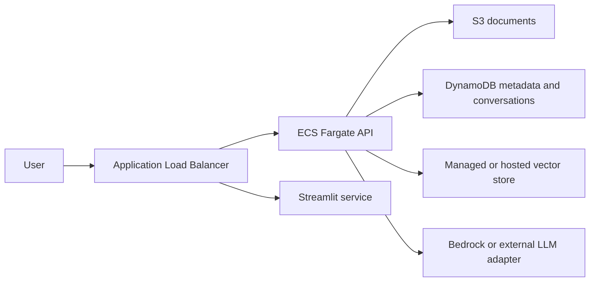

# Future AWS deployment

This document describes a future deployment target. It is intentionally
documentation-only: no AWS resources are created by this repository.

The local container setup also includes an API healthcheck and waits for the
API to become healthy before starting the Streamlit container.

## Proposed production shape



## Local-to-AWS mapping

| Local implementation | Future AWS concern |
| --- | --- |
| JSON conversation repository | DynamoDB or Aurora PostgreSQL |
| Local PDF directory | S3 bucket with encryption |
| JSON vector store | Chroma service, OpenSearch, or another managed vector store |
| OpenRouter adapter | Bedrock adapter or another provider adapter |
| Uvicorn process | ECS Fargate service |
| Streamlit process | Separate ECS service or internal tool |

## Provider replacement

The RAG application depends on `LLMProvider`, `EmbeddingProvider`, and
`VectorStore` ports. An AWS deployment should add adapters in infrastructure
and select them through configuration. The RAG use case must not import
`boto3`, Bedrock clients, or AWS SDK types directly.

## Security requirements before deployment

- store secrets in AWS Secrets Manager or Parameter Store;
- use IAM task roles instead of long-lived access keys;
- keep S3 private and restrict access through the API;
- validate PDF type and size server-side;
- add authentication before exposing the API publicly;
- enable encryption and audit logging;
- define retention and deletion policies for uploaded documents;
- avoid sending sensitive documents to external providers without approval.

## Cost control

AWS deployment is not part of the free local workflow. Before provisioning,
validate current service pricing, free-tier eligibility, region availability,
logging costs, storage costs, model inference costs, and data transfer costs.
Use budgets, quotas, and explicit maximum token limits before enabling any
remote model.

## Terraform direction

Future Terraform modules should be separated by responsibility:

```text
infra/terraform/
├── environments/
│   └── dev/
├── modules/
│   ├── networking/
│   ├── api/
│   ├── storage/
│   └── secrets/
└── README.md
```

Terraform must remain opt-in and should require an explicit plan review before
apply.
## Container dependency profiles

The default Dockerfiles intentionally use the lightweight backend profile. A
future semantic-embedding deployment should use a separate image or install
`requirements-embeddings.txt` explicitly, because Sentence Transformers and
PyTorch are not included in the base API image.
